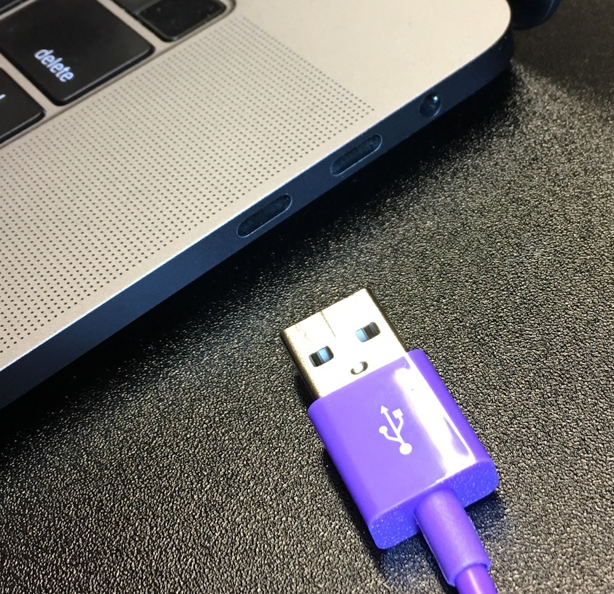
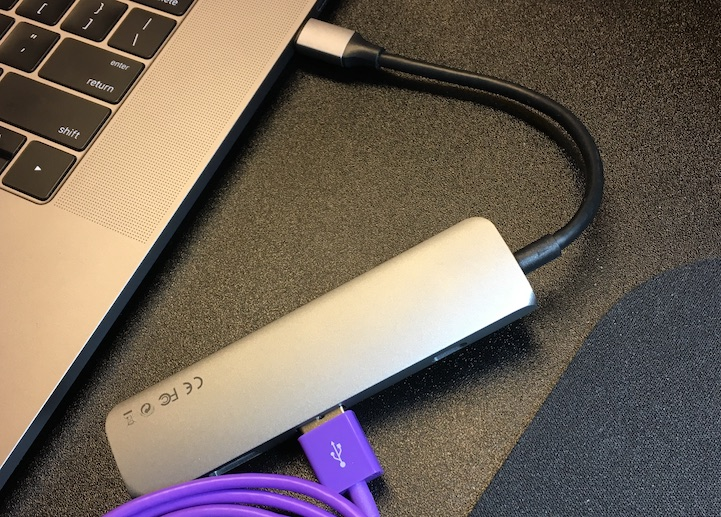

# Build a Smart Camera with Nerves

Thanks for signing up to come to the Nerves training event at Lone Star
ElixirConf 2019! I really hope you enjoy the class, learn some new things, and
come away with the skills and tools to build something cool. I'm so excited to
meet you all and geek out with Nerves!

## Training Prep Checklist

Since this is a one-day training event, and we have a lot of material to cover,
it's important to get some of the preparation work done ahead of time. If you
run into trouble trying to complete everything below, **don't stress about it**
too much. **We will have helpers** at the event to make sure you get everything
working. Just try to **get through as much as you can** ahead of time, so you
can use your class time more productively.

### Getting help

If you want some help getting ready for the event, get in touch by email, by
asking a question in the Nerves section of the ElixirForum, or by asking in the
`#nerves` channel in the Elixir-lang Slack. Even if you don't need help, I
highly recommend that you join the Nerves Slack channel! 💜

ElixirForum: https://elixirforum.com/c/nerves-forum
Elixir-Lang Slack: https://elixir-slackin.herokuapp.com/

### Help me understand my audience

You should have received **an email from me** that includes this document. So I
can organize the material in a way that will help you learn, I would _really
really_ like for you to **reply to that email** with the following:

* What operating system are you bringing? (Windows, OSX, Linux, ...other? 😬😅)
* Your experience level with: (none, some, lots)
  * Programming
  * Hardware and Embedded Systems
  * Elixir
  * Phoenix
  * Nerves
  * JavaScript
  * GraphQL
* Anything in particular that you hope to learn?

### What to bring

* A computer (see the sections below about setting up the required software).
* Whatever dongles you need to allow you to plug in a standard-size USB cable.

  
  

* A sense of fun and adventure.

### What will be provided

* Hardware
  * Raspberry Pi Zero W
  * Raspberry Pi Foundation Zero case with 3 covers
  * Raspberry Pi Camera V2
  * Adafruit Raspberry Pi Camera Lens Adjustment Tool
  * 16 GB Class 10 MicroSD Card
  * MicroSD Card reader
* Cables
  * Male USB to MicroUSB
  * Female USB to MicroUSB (OTG cable)
  * HDMI to Mini HDMI
  * Zero-size camera ribbon cable
  * Standard-size camera ribbon cable (for use with Raspberry Pi 1, 2, and 3)
* Accessories
  * 5V 2.5A MicroUSB AC power adapter
  * 40-pin header (not soldered)
  * Heatsink (also not attached)
  * Pre-printed QR codes
  * Nerves Stickers!

### Getting your computer ready

The material is has primarily been designed for Mac OSX, so that's preferred if
you have access to a Mac. Linux will also work fine if you know your way
around. Windows should also work if you're using Windows 10 with the Windows
Subsystem for Linux installed, but I will warn that the experience won't be as
smooth because we're still working out some issues on Windows. Check out [this
video] by [Tim Mecklem] if you need help getting started with Windows.

[this video]: https://www.youtube.com/watch?v=rzV0qfhzzqc
[Tim Mecklem]: https://twitter.com/tim_mecklem

Please verify that any corporate antivirus or network protection software
doesn’t prevent you from **writing to or reading from Flash drives connected via
USB ports**, or from **making outbound network connections** to your Nerves
device. If this is the case, it would be best to bring a different laptop if you
can.

Here's what you'll need to get installed on your computer:

* A programmer's text editor

  If you already have a preferred text editor, that will probably work fine.
  You'll want to make sure you have a plugin installed for Elixir
  syntax-highlighting.

  If you're not already comfortable with something else, I recommend [Atom].
  You'll want to install the `language-elixir` package (from **Preferences** ->
  **Install**). You may also want to look at the `autocomplete-elixir` and
  `atom-elixir` packages, but those aren't required.

  [Atom]: https://atom.io/

* Several command-line tools we will be using

  If you're using **OSX**, you'll need to do the following:

  * Install Xcode (from the App Store) if you haven't already
  * Set up the Xcode command-line tools:

    ```bash
    xcode-select --install
    ```

  * Install Homebrew from https://brew.sh/
  * Install the tools:

    ```bash
    brew install coreutils automake autoconf openssl libyaml readline libtool fwup squashfs picocom
    ```

  * Install Docker for Mac from https://www.docker.com/docker-mac
  * Click the Docker icon in the top menu bar
  * Click **Preferences** > **Advanced**
  * Allow Docker to use all of your CPUs and as much RAM as you think is
    reasonable for your machine. The more resources it has access to, the faster
    you can compile a custom Nerves system.

  If you're using **Linux** (assuming Ubuntu here), you'll need to do the
  following:

  * Install the tools:

    ```bash
    sudo apt-get install ssh-askpass squashfs-tools git g++ libssl-dev libncurses5-dev bc m4 make unzip cmake python picocom
    ```

  If you're using **Windows 10**, you'll need to do the following:

  * See Tim Mecklem's video above for a walk-through
  * Install Windows Subsystem for Linux from https://docs.microsoft.com/en-us/windows/wsl/install-win10
  * Choose Ubuntu as your Linux distribution
  * Once you get into the Linux shell, install the tools:

    ```bash
    sudo apt-get install ssh-askpass squashfs-tools git g++ libssl-dev libncurses5-dev bc m4 make unzip cmake python picocom
    ```
  * Reach out for help if you get stuck. Windows support for Nerves is still a
    work-in-progress, but we want to make it as easy as possible.

* Erlang and Elixir

  We **recommend using ASDF** to manage Erlang and Elixir installations. The
  reason is that Nerves requires the Erlang version running on your laptop to be
  the same as the Erlang version on the embedded target. There are many ways of
  accomplishing this, so if you have an equivalent way that doesn't use ASDF,
  that's fine.

  You can learn more about what ASDF is and why we use it for Nerves at:
  http://embedded-elixir.com/post/2017-05-23-using-asdf-vm/)

  To install ASDF: (more details at
  https://github.com/asdf-vm/asdf/blob/master/README.md#setup)

  ```bash
  git clone https://github.com/asdf-vm/asdf.git ~/.asdf --branch v0.6.3
  # The following steps are for BASH, which is usually the default shell.
  # If you’re using something else, you probably know the equivalent thing you
  # need to do.
  echo -e '\n. $HOME/.asdf/asdf.sh' >> ~/.bash_profile
  echo -e '\n. $HOME/.asdf/completions/asdf.bash' >> ~/.bash_profile
  source ~/.bash_profile
  ```

  For this class, we will be using Erlang 21 and Elixir 1.8.1. To get those
  installed using ASDF, do the following:

  ```bash
  asdf plugin-add erlang https://github.com/asdf-vm/asdf-erlang.git
  asdf plugin-add elixir https://github.com/asdf-vm/asdf-elixir.git
  asdf install erlang 21.2.5 # This takes a while
  asdf install elixir 1.8.1-otp-21
  asdf global erlang 21.2.5
  asdf global elixir 1.8.1-otp-21
  ```

  After installing those, make sure that the rebar and hex archives are up-to-date:

  ```bash
  mix local.hex --force
  mix local.rebar --force
  ```

  Install the `nerves_bootstrap` archive (you should get `v1.4.3` or newer):

  ```bash
  mix archive.install hex nerves_bootstrap --force
  ```
